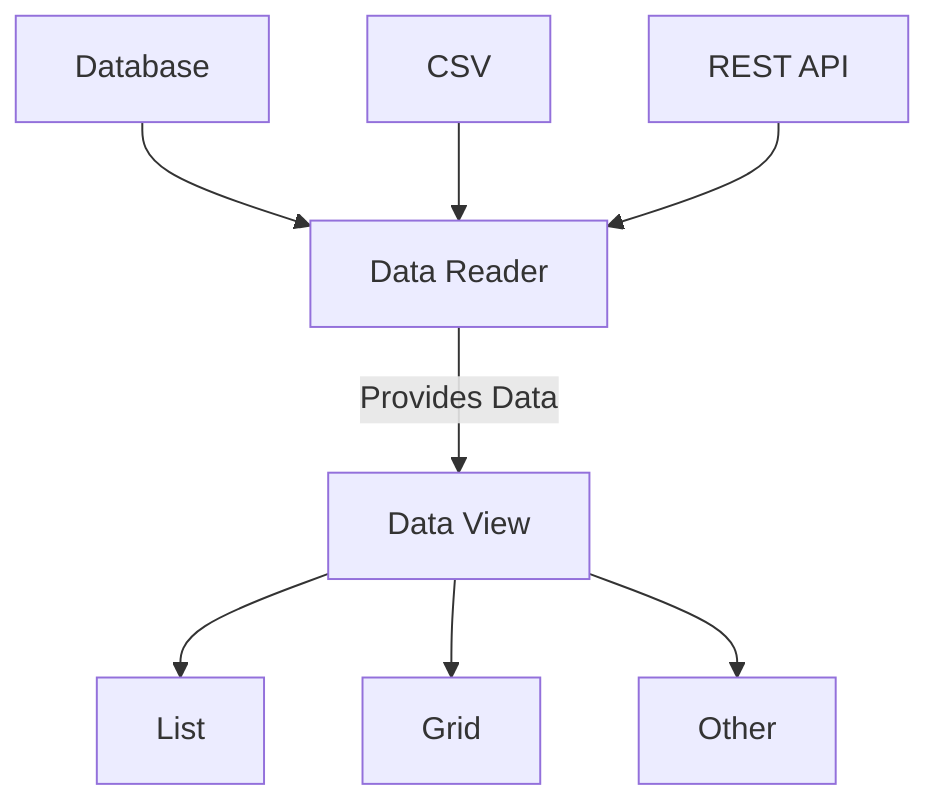

# Concept

Data view widgets are meant to be used to render items from various data readers 
from [yiisoft/data](https://github.com/yiisoft/data) package.
The idea is that data itself and how it's obtained, sorted, paginated, etc. is separated from how it's rendered.
The same data reader could be rendered as a list or a grid or something else, and vice versa, the grid could render
data coming from database, CSV or even REST API. In both cases, a developer changes either only how the data is obtained
or how the data is rendered.

